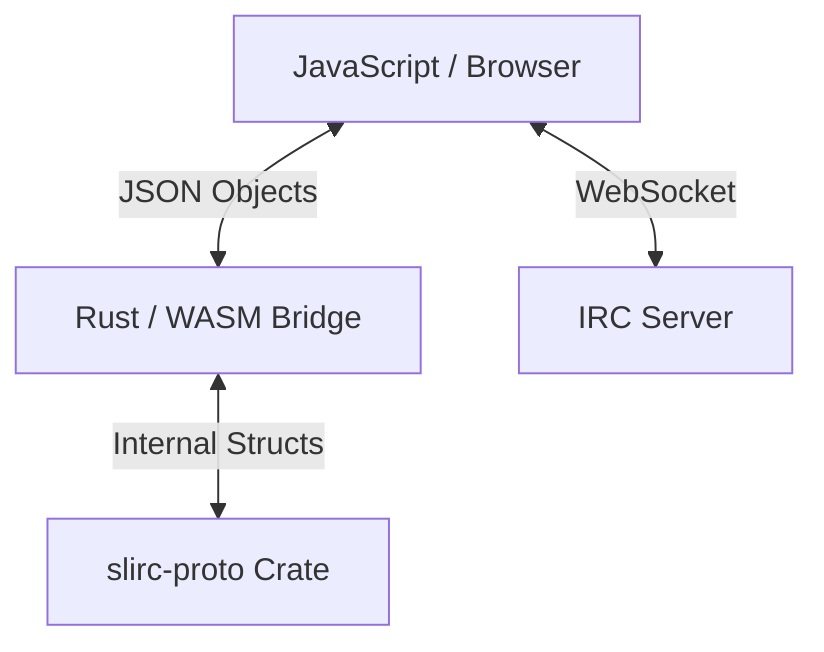

# SLIRC WASM Bridge

This crate provides a WebAssembly bridge for the `slirc-proto` library, allowing JavaScript environments (like the `slirc.net` web client) to use the exact same IRC protocol parsing logic as the server and desktop client.

## Purpose

To eliminate parser inconsistencies between the frontend and backend by compiling the Rust protocol implementation to WASM. This ensures that the web client behaves exactly like the native client and server, sharing the same validation rules and message structures.

## Architecture

The web client uses a **Hybrid Architecture**:

1.  **JavaScript (Main Thread)**: Handles the WebSocket connection, UI rendering, and user input.
2.  **WASM (Rust)**: Handles protocol parsing, message construction, and validation.



### Data Flow
1.  **Incoming**: Server sends raw IRC string -> JS receives via WebSocket -> JS calls `parse(string)` -> WASM returns typed JSON object.
2.  **Outgoing**: User types command -> JS calls `build(json_object)` -> WASM returns raw IRC string -> JS sends via WebSocket.

## Project Structure

```
slirc-wasm/
├── Cargo.toml          # Dependencies (wasm-bindgen, serde, tsify)
├── src/
│   ├── lib.rs          # Main exports: parse(), build()
│   └── utils.rs        # Panic hook, helper functions
├── tests/
│   └── web.rs          # WASM-specific tests (wasm-bindgen-test)
└── README.md           # Usage instructions
```

## Research Findings & Decisions

### Serialization Strategy
We use **`serde-wasm-bindgen`** for efficient data transfer between Rust and JS.
-   **Pros**: Low overhead, direct mapping to JS values (no JSON stringify/parse step), supports `Map`/`Set`.
-   **Config**: We will use `Serializer::json_compatible()` to ensure the output is idiomatic JSON-like objects for easier consumption in JS.

### TypeScript Integration
We use **`tsify`** to automatically generate TypeScript definitions.
-   **Benefit**: The frontend gets full type safety for complex IRC messages without manually maintaining `.d.ts` files.
-   **Mechanism**: `tsify` derives `IntoWasmAbi` and `FromWasmAbi`, handling the glue code automatically.

### Existing Serde Support
`slirc-proto` already supports Serde via the `serde` feature flag.
-   **Supported Types**: `Message`, `Command`, `Prefix`, `Response`, `Tag`.
-   **Format**: Default enum serialization is externally tagged (e.g., `{ "PRIVMSG": [...] }`). This is acceptable and type-safe.

## API Reference

This crate exposes the following functionality to JavaScript:

### Core Functions

```typescript
// Parse a raw IRC line into a structured Message object
export function parse(input: string): IrcMessage;

// Build a raw IRC line from a structured Message object
export function build(msg: IrcMessage): string;

// Get the version of the underlying protocol library
export function version(): string;
```

### Helper Functions (Planned)
Convenience wrappers for common operations:
```typescript
export function make_privmsg(target: string, text: string): string;
export function make_join(channel: string): string;
```

## Implementation Roadmap

### Phase 1: Project Configuration
- [x] Initialize `slirc-wasm` crate
- [x] Add to workspace `Cargo.toml`
- [ ] Update `slirc-wasm/Cargo.toml`:
    -   Add `wasm-bindgen`, `serde-wasm-bindgen`, `console_error_panic_hook`.
    -   Add `tsify` with `js` feature.
    -   Enable `serde` feature on `slirc-proto`.
    -   **Critical**: Set `default-features = false` for `slirc-proto` to avoid pulling in `tokio`.
- [ ] Configure `[profile.release]` for size optimization (LTO, `opt-level = "s"`).

### Phase 2: Core Bridge Implementation
- [ ] Implement `parse(input: &str) -> Result<JsValue, JsValue>`
    -   Use `serde_wasm_bindgen::to_value`.
- [ ] Implement `build(val: JsValue) -> Result<String, JsValue>`
    -   Use `serde_wasm_bindgen::from_value`.
- [ ] Verify error handling (Rust errors should propagate as JS exceptions).

### Phase 3: TypeScript Generation
- [ ] Add `wasm` feature to `slirc-proto/Cargo.toml`.
- [ ] Add `tsify` dependency to `slirc-proto` (optional, guarded by `wasm` feature).
- [ ] Annotate `Message`, `Command`, etc. with `#[derive(Tsify)]` guarded by `#[cfg(feature = "wasm")]`.
- [ ] Export generated types in `slirc-wasm`.

### Phase 4: Frontend Integration
- [ ] Create a simple test page in `www/test.html`.
- [ ] Load the WASM module.
- [ ] Connect to a WebSocket echo server to test round-trip parsing.

## Testing & Verification

```bash
# Run standard unit tests
cargo test

# Run WASM tests (requires headless browser)
wasm-pack test --headless --firefox
```

## Frontend Integration Guide

To use this in `slirc.net`:

1.  **Build the WASM**:
    ```bash
    wasm-pack build --target web --release
    ```

2.  **Import in JavaScript**:
    ```javascript
    import init, { parse, build } from './pkg/slirc_wasm.js';

    async function run() {
        await init(); // Initialize WASM module

        // Parse incoming
        const msg = parse(":nick!user@host PRIVMSG #channel :Hello!");
        console.log("Command:", msg.command); 

        // Build outgoing
        const raw = build({
            command: { PRIVMSG: ["#channel", "Hello back!"] }
        });
        socket.send(raw);
    }
    run();
    ```

## Dependencies

```toml
[dependencies]
wasm-bindgen = "0.2"
serde = { version = "1.0", features = ["derive"] }
serde-wasm-bindgen = "0.6"
console_error_panic_hook = "0.1"
tsify = { version = "0.4", features = ["js"] }

[dependencies.slirc-proto]
path = "../slirc-proto"
default-features = false
features = ["serde"] 
# Note: "wasm" feature to be added to slirc-proto for tsify support
```

## Size Optimization Strategy

We aim for a bundle size under 300KB (raw) / 80KB (gzipped).

1.  **Compiler Options**:
    ```toml
    [profile.release]
    opt-level = "s"
    lto = true
    codegen-units = 1
    strip = true
    panic = "abort"
    ```
2.  **Feature Pruning**: Ensure `slirc-proto` does not bring in `tokio`, `bytes`, or other heavy runtime deps.

## Architecture Decision Records (ADR)

### ADR-001: Use WASM for Protocol Parsing
**Status**: Accepted
**Rationale**: Single source of truth. Eliminates "client parses differently than server" bugs.

### ADR-002: Use `serde-wasm-bindgen`
**Status**: Accepted
**Rationale**: Low overhead, idiomatic JS objects.

### ADR-003: Use `tsify` for Types
**Status**: Accepted
**Rationale**: Automated type safety.
**Constraint**: Requires adding `tsify` support to `slirc-proto` structs eventually. For Phase 1, we may skip strict TS generation if modifying `slirc-proto` is too disruptive, but it remains the goal.

### ADR-004: Hybrid Architecture
**Status**: Accepted
**Rationale**: Rust is great for parsing (CPU bound, logic heavy), JS is great for IO (WebSockets, DOM). We play to each language's strength.
